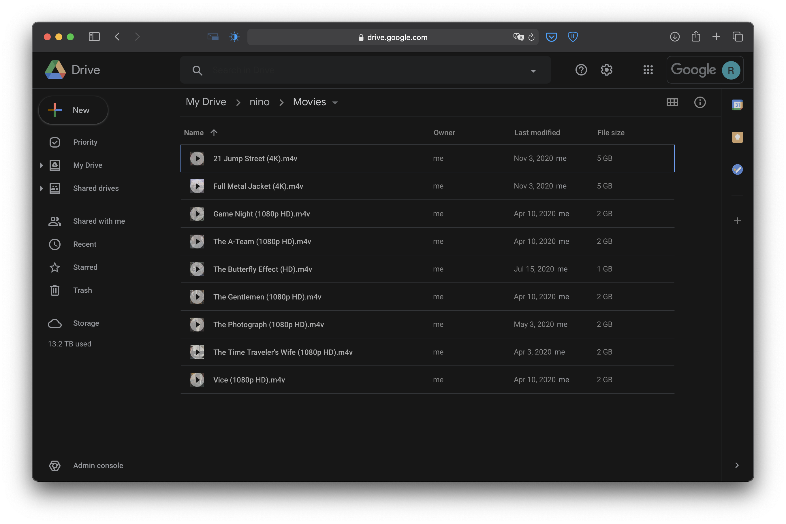
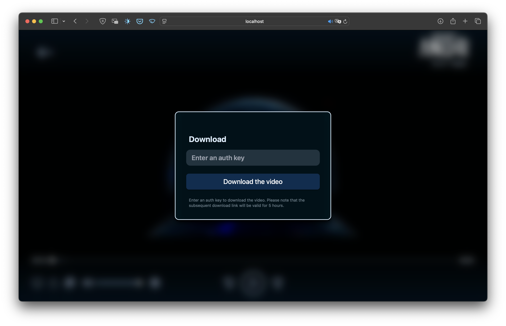
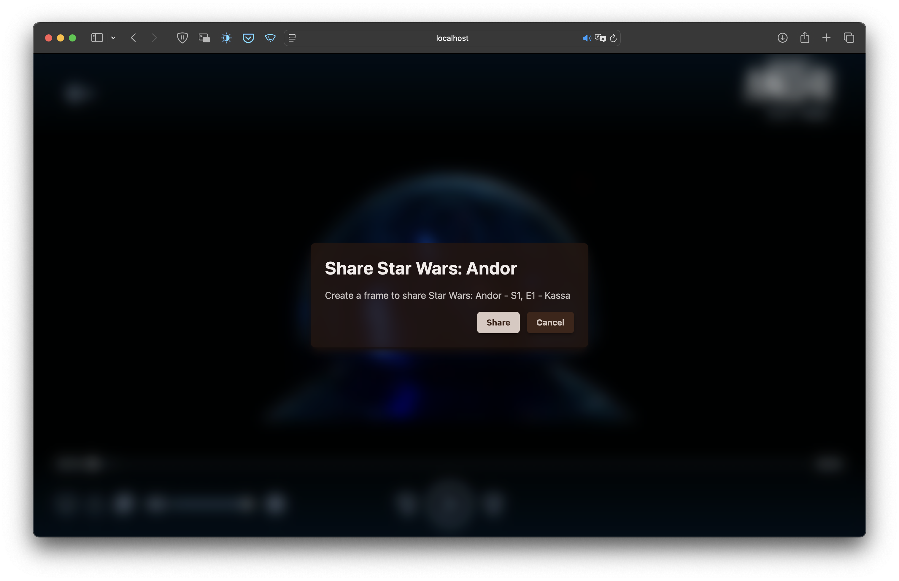
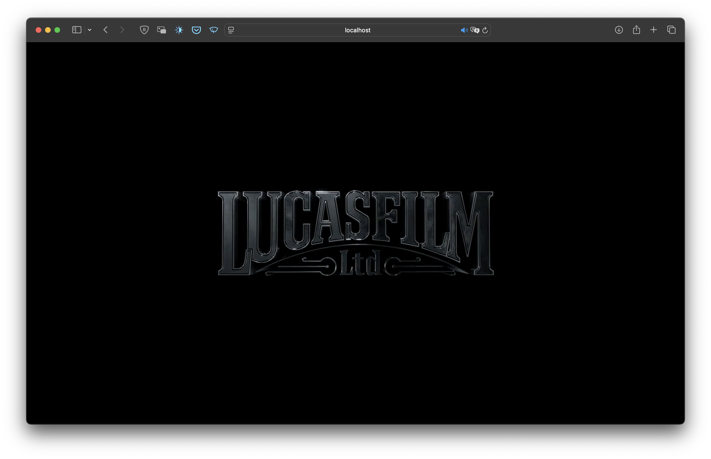
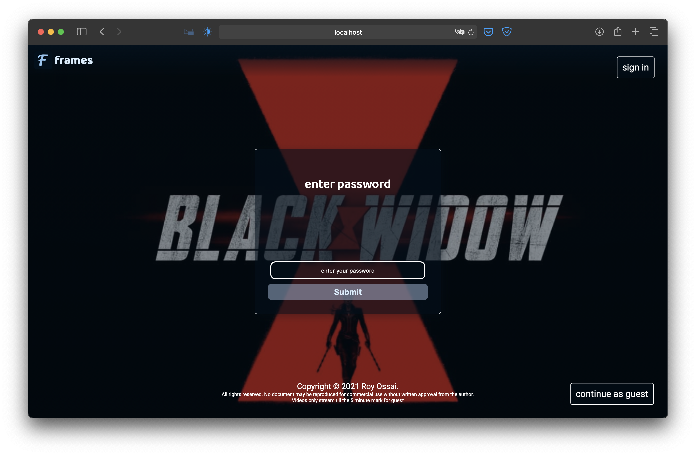
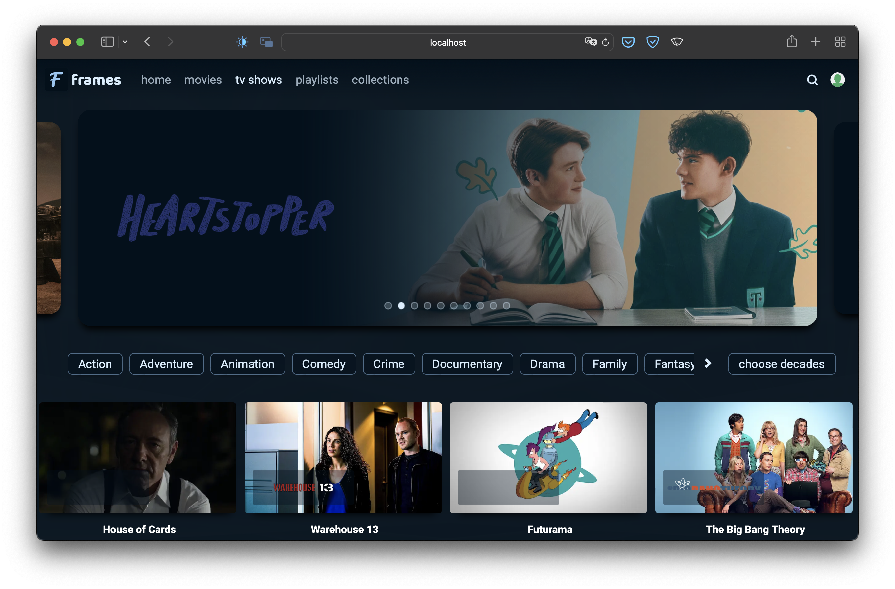
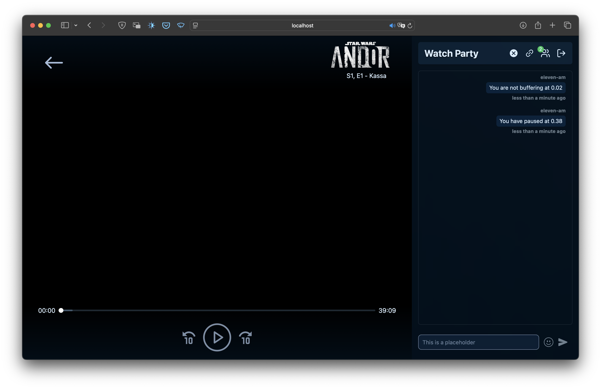
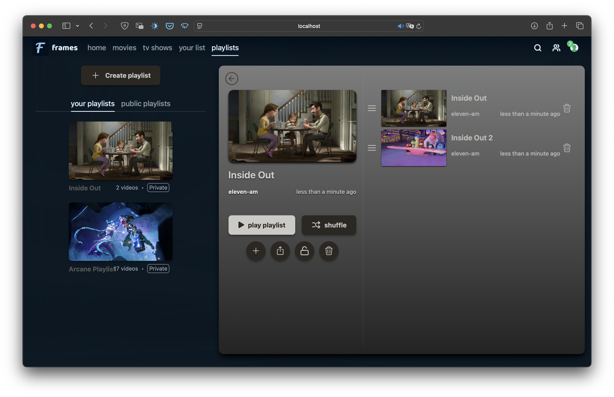
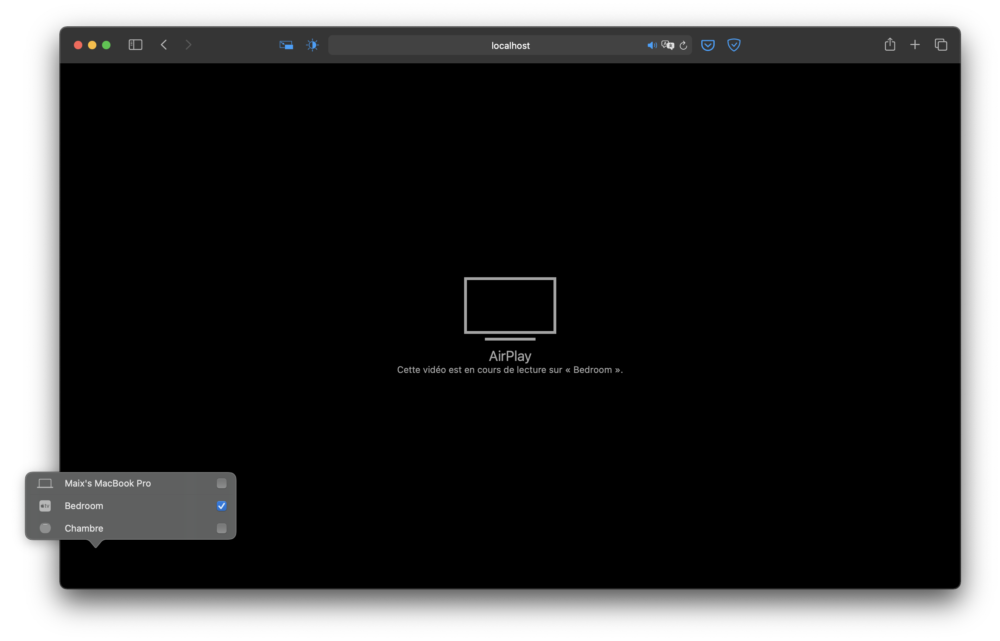

# Frames

Frames is a VOD streaming service built with react and NextJs around the Google Drive API.

### What is frames and how does it work ?
Frames is a web application that allows you to store, organise, download and stream media contents available on your Google Drive.
The application enables you share this library without compromising the integrity of the original files.
It organises the Movies and TV shows on your drive account, providing you with their trailer, HD images and other info

## Installation
The process to installing frames is straight forward to begin, visit https://frameshomebase.maix.ovh and follow the setup process.
A 'frames.env' file would be downloaded once the setup process is complete.
    
## Run Locally

Clone the project

```bash
  git clone https://github.com/Eleven-am/frames.git
```

Go to the project directory

```bash
  cd frames
```

Place frames.env in the directory then rename it to .env

```bash
  mv frames.env frames/.env
```

Install dependencies and set up database

```bash
  npm install && npx prisma db push
```

Build the server

```bash
  npm run build
```

Start the server

```bash
  npm run start
```

## How to arrange the files
* For movies, it is imperative that only the movie file itself is placed directly in the movie folder like so 
* For TV shows every Show should be placed in its folder like so 
* When arranging the episodes you have two options
    * Place each episode in its corresponding Season folder, like so (Recommended)  
    * Alternatively you can place them directly in the Show folder but only if they can pass this s|SXX .. eE|XX naming scheme, for example;
        * S01 - E01
        * S01 randomText E01
        * s01e01 | S01E01
          like so 

## Images and Features
* The boarding page includes social authentication methods as well as email. Every user registered must be provided an auth key 
    
    
    
    

* The home page includes (ideally 7, may be less or 0) trending media that are available in your library. A synopsis of the media and trailer are also available directly from here
   
   

#### The navigation bar
* All the movies and tv shows available in the library are show in descending order from most recent or trending to less recent
  
  

* You can see all the genres for the medias available in your library. Your library can also be sorted by decades depending on when they were released or first aired.
  
  

* #### The playlist feature is still in development

* Here's how a media's metadata is displayed on frames
  
  
  
  

* Media produced by a specific company can be seen by simply clicking on the company's name in the details pane
  
    * Clicking on the company's logo begins playback of all the media produce by the company in the order they were made available by said company

#### Frames(aka the video player)
* Frames supports only mp4 files. These files are streamed securely to the user and your Google credentials are never made available to the client.
  
    * The left controls include the AirPlay/Cast button (if available). The volume controls
    * If not logged in as a guest user, there are two additional buttons the download button(not functional yet) and the Share button
      

* Frames has AirPlay and Chromecast functionality built in
  


